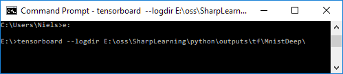
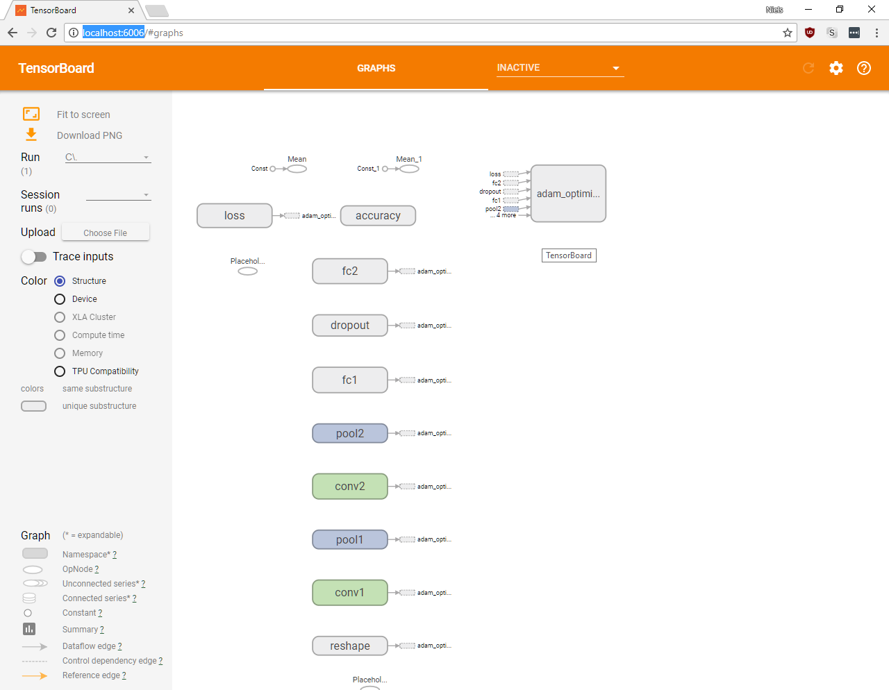
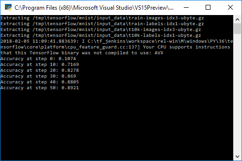

# Installation

## Python 3.6 in Visual Studio 2017
Use **Visual Studio Installer** -> select **Modify**.

Workload:
 * Install **Data science and analytical applications**  workload

Components:
 * Install **Python language support**
 * Install **Python 3 64-bit** (e.g. 3.6.3)

Install Tensor Flow packages:
 * Start Visual Studio, open **Python Environments**
 * Select **Python 3.6 (64-bit)**
 * On the **Overview** combo box select **Packages**
 * Search for `tensorflow` and install.

 # Running
 Right click a `py` file and select **Start with Debugging** for example, or set as startup file and press F5.


## TensorBoard
Open normal **Command Prompt** and set `logdir` to directory of a run e.g. from `MnistDeep.py`:

```
C:\Users\Niels>e:
E:\tensorboard --logdir E:\oss\SharpLearning\python\outputs\tf\MnistDeep
```
NOTE: You **must** change to the drive `E` that has the log files, 
since otherwise tensorboard cannot load it.



Note couldn't use Developer Command Prompt or other such, had to use normal command prompt.

Open browser window at http://localhost:6006



### Mnist with summaries example
* Run the `mnist_with_summaries.py` file in this project.

